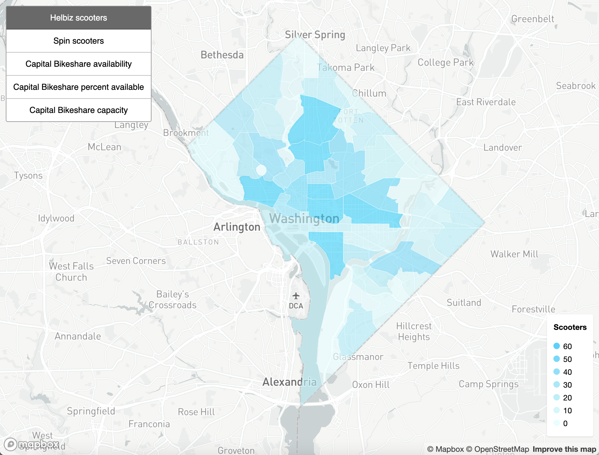
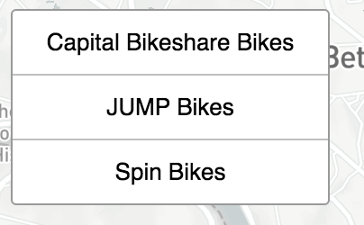
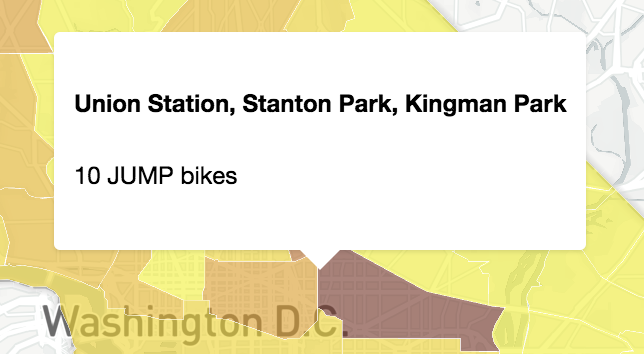

# DC Bikeshare Bikes per Neighborhood

https://www.alexandraulsh.com/dc-bikeshare-by-neighborhood

A map that lets you analyze and explore the number of DC bikeshare bikes by DC neighborhood clusters.



## How do I view the data?

Click a bikeshare service in the left hand menu.



Then mouse over different neighborhoods to see how many bikes for that bikeshare service are in that neighborhood cluster.



## Data

### DC Neighborhood Cluster Polygons

DC neighborhood clusters come from the District of Columbia's Office of the Chief Technology Officer's [DC Open Data Portal](http://opendata.dc.gov/datasets/neighborhood-clusters). Note: the government of D.C. does not provide official neighborhood polygons. These are instead "neighborhood clusters."

Neighborhoods no longer loading? Did the URL change or break? [Please create a new issue to report this bug](https://github.com/alulsh/dc-bikeshare-by-neighborhood/issues/new).

### Capital Bikeshare

Station capacity information comes from [Motivate's](https://www.motivateco.com/use-our-data/) [General Bikeshare Feed Specification](https://gbfs.capitalbikeshare.com/gbfs/gbfs.json) JSON API for Capital Bikeshare.

The [station information endpoint](https://gbfs.capitalbikeshare.com/gbfs/en/station_information.json) endpoint provides station latitude, longitude, and capacity.

### JUMP Bikes

JUMP bike data for DC is available on their [DC open data portal](https://dc.jumpmobility.com/opendata) in [GBFS format](https://github.com/NABSA/gbfs).

### Spin

Per this February 6th, 2018 tweet from [DDOT](https://twitter.com/DDOTDC/status/960885112731832320), Spin API information is available at https://web.spin.pm/api/gbfs/v1/gbfs in GBFS format.

### LimeBike

Per this February 6th, 2018 tweet from [DDOT](https://twitter.com/DDOTDC/status/960885111066636289), LimeBike bike information is available at `https://lime.bike/api/partners/v1/bikes?region=Washington%20DC%20Proper` with a bearer token. The data is not available in GBFS format.

Unfortunately this endpoint has no `Access-Control-Allow-Origin` header. You get the following CORS error when attempting to access this endpoint via client-side JavaScript:

```
Failed to load https://lime.bike/api/partners/v1/bikes?region=Washington%20DC%20Proper: Response to preflight request doesn't pass access control check: No 'Access-Control-Allow-Origin' header is present on the requested resource. Origin 'http://localhost:5000' is therefore not allowed access. The response had HTTP status code 404.
```

Check out [the LimeBike Node.js script](https://github.com/alulsh/dc-bikeshare-by-neighborhood/blob/master/scripts/limebike.js) in this repo for live LimeBike data per D.C. neighborhood cluster.

### Mobike

[Mobike](https://mobike.com/global/) does not provide an official public API. [There is an endpoint you can submit a POST request to](https://github.com/ubahnverleih/WoBike#mobike-china-italy-uk-japan), but it doesn't seem designed or intended for public use. You must set the `Referer` and `user-agent` headers to match a WeChat client. Once they provide a public API we'll be able to add it to this map.

### Ofo

[Ofo](https://www.ofo.com/us/en) does not provide an API that can be securely used with client side JavaScript. [Their API requires authentication with an OTP code and authorization token](https://github.com/ubahnverleih/WoBike/blob/master/Ofo.md).

## Local development

Want to run this project locally? If you have Node and npm installed then run the following commands:

```sh
git clone git@github.com:alulsh/dc-bikeshare-by-neighborhood.git
cd dc-bikeshare-by-neighborhood
npm install
npm start
```

Don't use Node and npm? You can still run this project locally by running `index.html` with any local web server.

## Tests

This project doesn't have unit tests but does use [eslint](https://eslint.org/) for linting. Linting tests run automatically after every commit with Travis CI.

## Scripts

The `scripts` directory of this project has Node.js scripts to fetch data from the various bikeshare services in Washington, D.C. These scripts are useful for debugging or obtaining data unavailable with client side JavaScript (e.g. LimeBike).

## Contributing

Notice a bug in the project? Did one of the missing bikeshare services recently implement a public API? [Create a new issue in this repository](https://github.com/alulsh/dc-bikeshare-by-neighborhood/issues/new) to help me out!