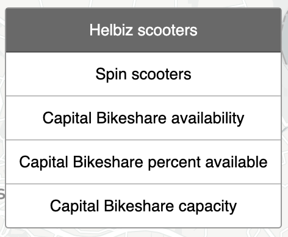
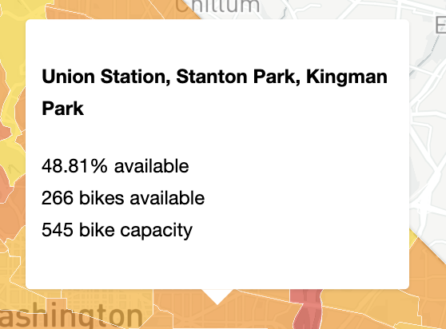
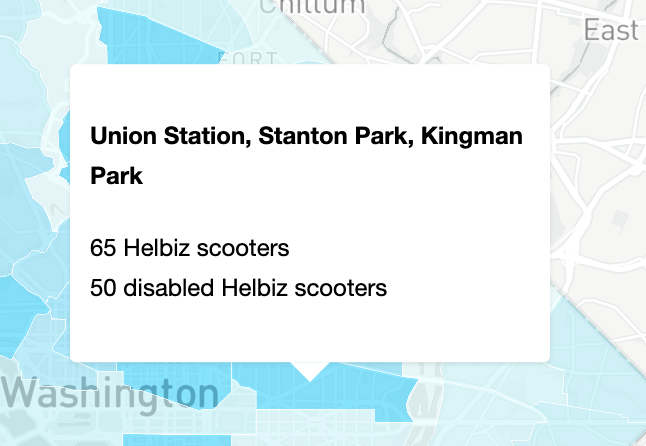
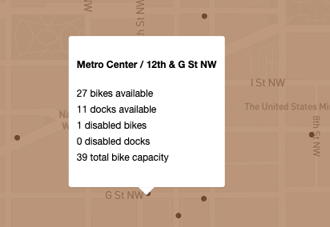
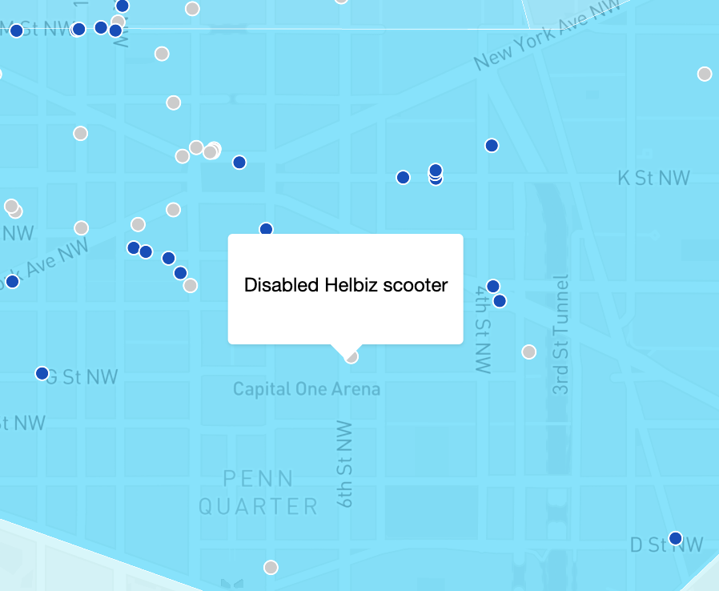

# DC Micromobility by Neighborhood

https://www.alexandraulsh.com/dc-micromobility-by-neighborhood/

Explore Washington, DC micromobility services by [DC neighborhood clusters](http://opendata.dc.gov/datasets/neighborhood-clusters).

## Features

### Toggle micromobility services

Toggle different micromobility service providers using the left-hand menu.

### Mouseover neighborhoods

Mouse over a DC neighborhood to see micromobility availability.

### Capital Bikeshare stations

When viewing Capital Bikeshare layers, zoom in to see points for bikeshare stations. Mouseover a station to see the station name, available bikes and docks, disabled bikes and docks, and station capacity.

### Scooters

When viewing scooter layers, zoom in to see points for scooters. Disabled scooters are gray.

## Data sources

### DC neighborhood clusters

DC neighborhood clusters come from the District of Columbia's Office of the Chief Technology Officer's [DC Open Data Portal](http://opendata.dc.gov/datasets/neighborhood-clusters). The government of DC does not provide official neighborhood polygons. Instead, they provide neighborhood cluster polygons.

### Current micromobility services in DC

The District Department of Transportation (DDOT) [maintains a list](https://ddot.dc.gov/page/dockless-api) of active public dockless micromobility (including bikeshare and scooter) APIs in Washington, DC.

#### Capital Bikeshare

Capital Bikeshare provides a [General Bikeshare Feed Specification](https://gbfs.capitalbikeshare.com/gbfs/gbfs.json) (GBFS) JSON API. Station capacity information comes from the [station information](https://gbfs.capitalbikeshare.com/gbfs/en/station_information.json) endpoint, while live station availability information comes from the [station status](https://gbfs.capitalbikeshare.com/gbfs/en/station_status.json) endpoint.

#### Helbiz

Helbiz operates electric scooters and provides a [GBFS](https://api.helbiz.com/admin/reporting/washington/gbfs/gbfs.json) API endpoint.

#### Spin

Spin operates electric scooters and provides a [GBFS](https://gbfs.spin.pm/api/gbfs/v1/washington_dc/free_bike_status) API endpoint. In [August 2018](https://dc.curbed.com/2018/8/20/17761122/dc-dockless-bikes-scooters-transportation-spin-pilot), Spin ended its dockless bike program and switched to electric scooters.

#### Current services without CORS

These micromobility services currently operate in DC but do not allow cross-origin resource sharing (CORS) on their API endpoints despite being listed publicly on [DDOT's website](https://ddot.dc.gov/page/dockless-api). While you can view these APIs anytime in a web browser or via a curl request, you can't use these APIs in client-side JavaScript.

##### JUMP/Lime

In May 2020, [Lime acquired Jump e-bikes from Uber](https://techcrunch.com/2020/05/07/uber-leads-170-million-lime-investment-offloads-jump-to-lime/). You can access live Jump e-bike data at https://data.lime.bike/api/partners/v1/gbfs/washington_dc/free_bike_status.json. Unfortunately, [this API does not allow cross-origin resource sharing](https://github.com/alulsh/dc-micromobility-by-neighborhood/issues/7), so you can't use this API in other applications.

##### Lyft

DDOT lists https://s3.amazonaws.com/lyft-lastmile-production-iad/lbs/dca/free_bike_status.json as a public API endpoint for Lyft scooters on its [dockless API page](https://ddot.dc.gov/page/dockless-api). While you can view the API freely in a web browser or via a curl request, since [this endpoint does not allow CORS](https://github.com/alulsh/dc-micromobility-by-neighborhood/issues/14), you can't use it in client-side JavaScript applications.

##### Bird

DDOT lists https://gbfs.bird.co/dc as a public API endpoint for Bird scooters on its [dockless API page](https://ddot.dc.gov/page/dockless-api). Unfortunately, this API endpoint suffers from [intermittent CORS errors](https://github.com/alulsh/dc-micromobility-by-neighborhood/issues/15).

### Historical micromobility services in DC

#### Razor

While Razor is still listed on DDOT's [dockless API page](https://ddot.dc.gov/page/dockless-api), it [stopped operating in DC in March 2020](https://www.washingtonpost.com/transportation/2020/02/27/lime-bird-bolt-razor-lose-appeals-operate-scooters-dc/).

#### Mobike

Mobike left the DC market in [July 2018](https://www.washingtonpost.com/news/dr-gridlock/wp/2018/07/25/mobike-becomes-second-dockless-bike-operator-to-pull-out-of-d-c/). They never provided an official public API. [There was an endpoint you could submit a POST request to](https://github.com/ubahnverleih/WoBike#mobike-china-italy-uk-japan), but it did not seem to be designed or intended for public use. You needed to set the `Referer` and `user-agent` headers to match a WeChat client.

#### Ofo

Ofo left the DC market in [July 2018](https://www.washingtonpost.com/news/dr-gridlock/wp/2018/07/24/dockless-bike-share-company-ofo-is-the-first-to-pull-out-of-d-c/). Ofo did not provide an API that could be securely used with client-side JavaScript. [Their main API required authentication with an OTP code and authorization token](https://github.com/ubahnverleih/WoBike/blob/master/Ofo.md).

[DDOT DC provided an API endpoint](https://twitter.com/DDOTDC/status/963143987216314368) but it was HTTP only. It also could not be used securely client-side.

## Privacy

All of the APIs used in this project are publicly available and listed on DDOT's [dockless API page](https://ddot.dc.gov/page/dockless-api). While these APIs provide anonymized data, they still include unique identifiers for each vehicle. This project goes one step further and removes unique identifiers from vehicle data.
