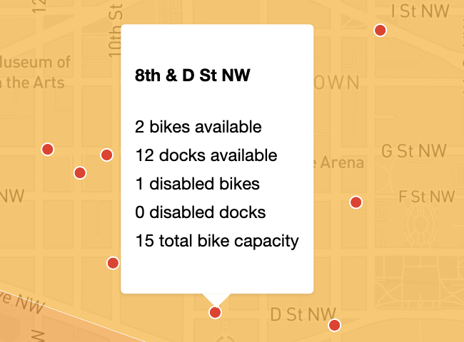

# DC Bikeshare Bikes by Neighborhood

https://www.alexandraulsh.com/dc-bikeshare-by-neighborhood

Explore Washington, DC bikeshare bikes by [DC neighborhood clusters](http://opendata.dc.gov/datasets/neighborhood-clusters).

## Features

### Toggle data sources

Toggle between different bikeshare data sources using the left-hand menu.

### Mouseover neighborhoods

Mouse over a DC neighborhood polygon to see the percentage of available bikes, total number of available bikes, and total planned bikeshare capacity for that neighborhood.

### Mouseover bikeshare stations

Zoom in to see black dots for the bikeshare stations in each neighborhood. Mouseover a station to see the station name, available bikes and docks, disabled bikes and docks, and station capacity.

## Data sources

### DC neighborhood clusters

DC neighborhood clusters come from the District of Columbia's Office of the Chief Technology Officer's [DC Open Data Portal](http://opendata.dc.gov/datasets/neighborhood-clusters). The government of DC does not provide official neighborhood polygons. Instead, they provide neighborhood cluster polygons.

### Current bikeshare services in DC

DDOT maintains a list of active public dockless micromobility (including bikeshare and scooter) APIs in https://ddot.dc.gov/page/dockless-api.

#### Capital Bikeshare

Capital Bikeshare provides a [General Bikeshare Feed Specification](https://gbfs.capitalbikeshare.com/gbfs/gbfs.json) (GBFS) JSON API. Station capacity information comes from the [station information](https://gbfs.capitalbikeshare.com/gbfs/en/station_information.json) endpoint, while live station availability information comes from the [station status](https://gbfs.capitalbikeshare.com/gbfs/en/station_status.json) endpoint.

#### JUMP/Lime

In May 2020, [Lime acquired Jump e-bikes from Uber](https://techcrunch.com/2020/05/07/uber-leads-170-million-lime-investment-offloads-jump-to-lime/). You can access live Jump e-bike data at https://data.lime.bike/api/partners/v1/gbfs/washington_dc/free_bike_status.json. Unfortunately, [this API does not allow cross-origin resource sharing](https://github.com/alulsh/dc-bikeshare-by-neighborhood/issues/7), so you can't use it in client-side JavaScript.

### Historical bikeshare services in DC

Most dockless pedal bike operations left Washington, DC, in [summer 2018](https://ggwash.org/view/69307/who-killed-dcs-dockless-pedal-bicycles).

#### Spin

Spin ended its dockless bike program and switched to electric scooters in [August 2018](https://dc.curbed.com/2018/8/20/17761122/dc-dockless-bikes-scooters-transportation-spin-pilot).

This February 6th, 2018, tweet from [DDOT](https://twitter.com/DDOTDC/status/960885112731832320) mentioned the former Spin API information was available at https://web.spin.pm/api/gbfs/v1/gbfs in GBFS format.

#### Mobike

Mobike left the DC market in [July 2018](https://www.washingtonpost.com/news/dr-gridlock/wp/2018/07/25/mobike-becomes-second-dockless-bike-operator-to-pull-out-of-d-c/). They never provided an official public API. [There was an endpoint you could submit a POST request to](https://github.com/ubahnverleih/WoBike#mobike-china-italy-uk-japan), but it did not seem to be designed or intended for public use. You needed to set the `Referer` and `user-agent` headers to match a WeChat client.

#### Ofo

Ofo left the DC market in [July 2018](https://www.washingtonpost.com/news/dr-gridlock/wp/2018/07/24/dockless-bike-share-company-ofo-is-the-first-to-pull-out-of-d-c/). Ofo did not provide an API that could be securely used with client-side JavaScript. [Their main API required authentication with an OTP code and authorization token](https://github.com/ubahnverleih/WoBike/blob/master/Ofo.md).

[DDOT DC provided an API endpoint](https://twitter.com/DDOTDC/status/963143987216314368) but it was HTTP only. It also could not be used securely client-side.
